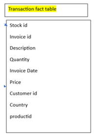
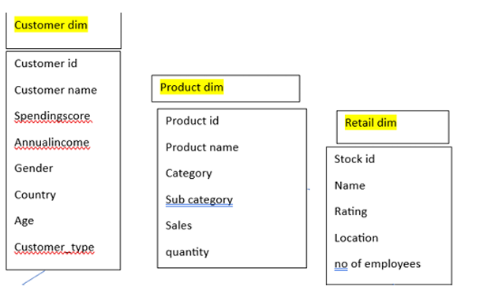
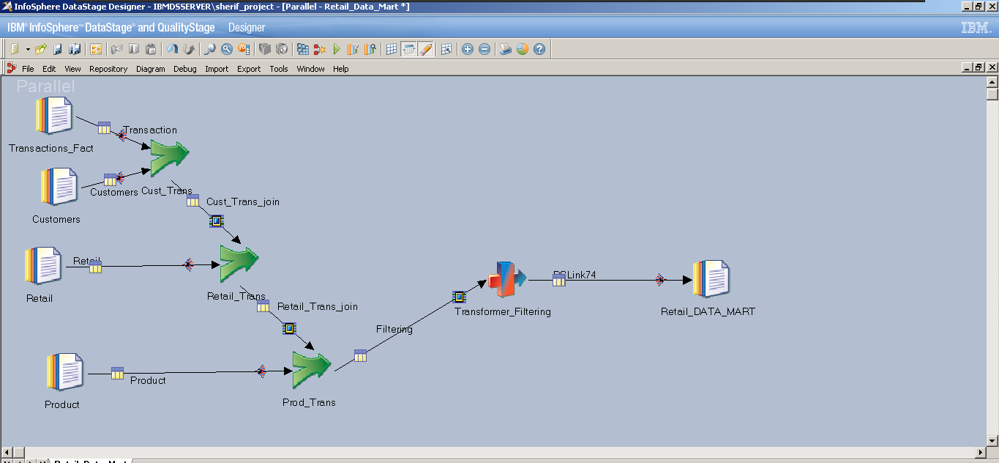
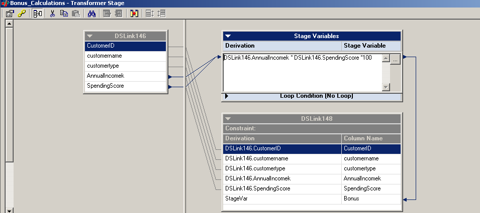
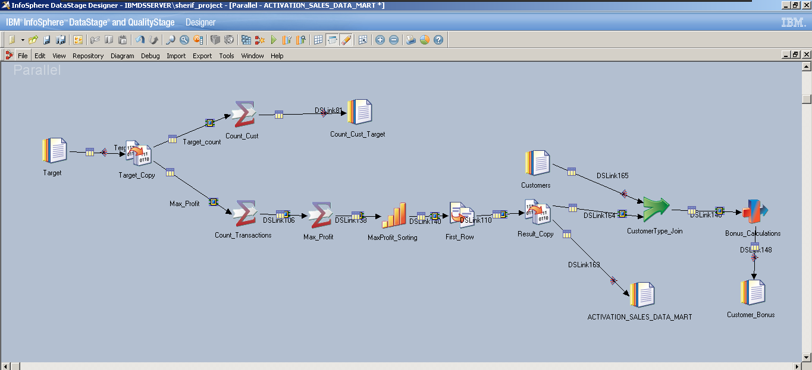

# Retail Industry ETL Project

A retail store having multiple csv files each one represents a table in the source system and they needed to load this data into data warehouse which consists of :
1. Fact table: 
           
2. Dimension tables: 
         

## 1- The first business requirement:
- Need data mart that display each transaction for each customer based on type of customer “citizen” or “foreign”  with information of it information of product and information of stock  which buy  with name file 
“RETAIL_DATA_MART” with transformation upper case of all customer name column and display column represent date instead of  dim date table.
- - Done by importing the table definetions for the 4 tables and then load them as sequential files, joining the transaction table with the customer table, the result is joined with the retail table, then the result of the last 2 joins is joined again with the product table to get the product information.
- - The result then went through a transformer which convert the customer name into uppercase and a new column for the current date is inserted, then loading the result in a sequential file.

## 2- The second business requirement:
-  read data mart “RETAIL_DATA_MART” Then answer the following business need: 
• Display count of all transaction for each customer for each store 
     - After loading the “RETAIL_DATA_MART” as sequential file and use a copy stage to use it to answer the various business questions, aggregator was used to count rows after grouping by customerid and stockid, the result is loaded into a sequential file "Count_Cust"

• Display max profit made by which customer type. Named DataMart “ACTIVATION_SALES_DATA_MART” 
• Based on which customer make profit , give them Bouns Equation = Annual_Incomek$* SpendingScore*100
     - By reusing the copy stage created earlier, aggregator was used to group by customer type and count transactions for each type, another aggregator was used to get the maximum value of this count for each type, sort stage is used to sort the values in descending order and then getting the head of the result to get only one record with the customer type and transactions count in “ACTIVATION_SALES_DATA_MART” after using a copy stage.

     - using the copy stage we just created, the result was joined with the customer table sequential file on the customer type to get the customers who belong to the max profit customer type and then a transformer was used to make a stage variable which calculate the bonus and use it in a new column and load the result into a new sequintial file "Customer_Bonus".

